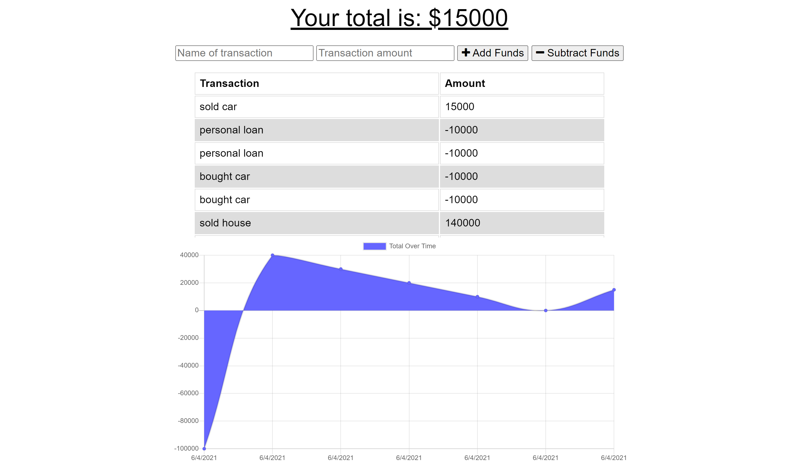

# Budget Tracker 
   
  ===========================================
    
  ## Description 
      This budget tracker is a Progressive Web Application.  It can be used when online or offline.  
  ## Table of Contents 
  - [Installation](#installation)
  - [Usage](#usage)
  - [Contributions](#contributions)
  - [Tests](#tests)
  - [Questions](#questions)
  - [License](#license)
  ## Installation 
        Make sure that MongoDb is running in one control-panel.  In another, run npm install in the directory with the repository. This app can be run locally or you can visit the deployed site at 
[https://frozen-earth-16728.herokuapp.com](https://frozen-earth-16728.herokuapp.com)
  ## Usage 
      When visiting the site, simply enter the name of the transaction and the transaction ammount.  Then select to either add or subtract the funds.  The transaction will be stored on a mongodb database when online and cached when offline.  All cached transactions will be added to the database when the app in online again.

  ## Contributions 
      This was created by:
* KellyJohnson364: [https://github.com/KellyJohnson364](https://github.com/KellyJohnson364)
            
            
            
         
           

   

  ## Questions 
If you have questions or feedback, please contact KellyJohnson364 at [https://github.com/KellyJohnson364](https://github.com/KellyJohnson364) or via email at kj3641402@gmail.com.

## License
This project is licensed under The Unlicense.
For more info click [The Unlicense](./assets/licenses/theunlicense.md).